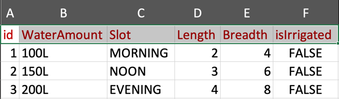
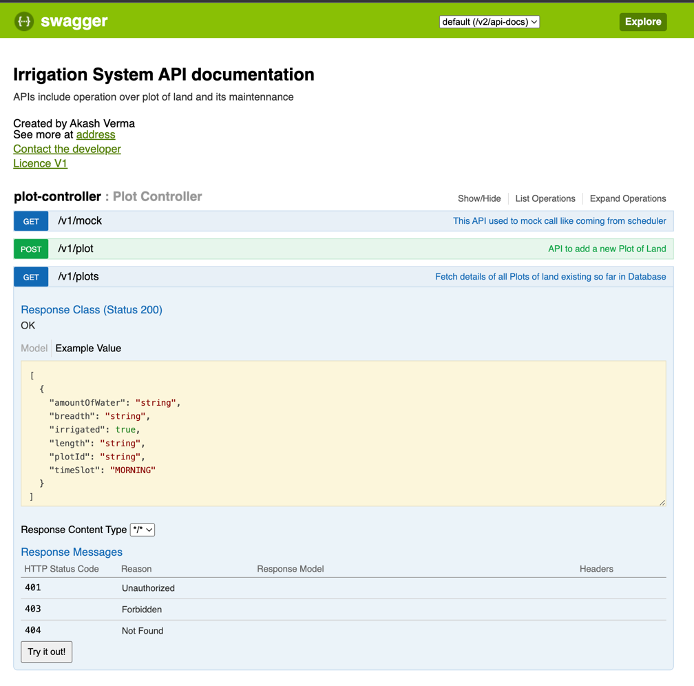

# Irrigation System
This system enables the sensor to pick the plot of land which is due for irrigation based on their pre-configured time slot (MORNING, NOON, EVENING).

The below seed data must be prepared either by DB script or by calling the add plot api

# Getting Started
Clone the project on local. 
Open in IntelliJ

Note - enable annotation processing for seamless lombok performance

### Reference Documentation
For further reference, please consider the following sections:

The swagger portal is added, refer snapshot

portal url hosted at - http://localhost:7071/swagger-ui.html

* 
* Swagger Json Documentation is hosted at 
* [swagger json document](http://localhost:7071/v2/api-docs)

### UML
The following guides illustrate how to the classes are modelled:

* plot

